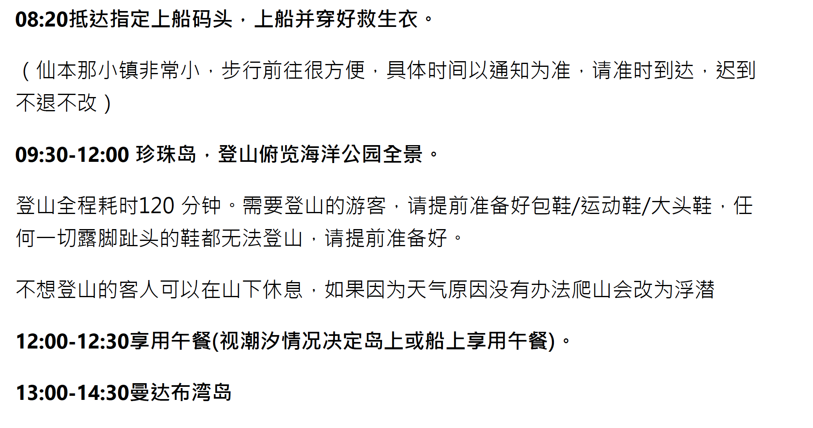

# 新马游（2023 国庆）

## 航班信息
- ✓ 表示已经核定出票
- [酷航官网](https://www.flyscoot.com/zh)

#### 郑  

| 日期 | 航班号       | 起飞城市         | 起飞时间 | 到达城市        | 到达时间 |
| ---- | ------------ | ---------------- | -------- | --------------- | -------- |
| 10-1 | EU2413 ✓     | 成都 (天府 T2) 🇨🇳 | 07:25    | 海口(美兰 T1)🇨🇳  | 09:55    |
| 10-1 | 酷航 TR119 ✓ | 海口(美兰)🇨🇳      | 11:45    | 新加坡🇸🇬  (樟宜) | 15:25    |
| 10-8 | D7320        | 吉隆坡🇲🇾          | 09:00    | 成都 🇨🇳          | 13:40    |

#### 邢 

| 日期 | 航班号      | 起飞城市 | 起飞时间 | 到达城市       | 到达时间 |
| ---- | ----------- | -------- | -------- | -------------- | -------- |
| 10-1 | 酷航TR139 ✓ | 天津🇨🇳    | 09:20    | 新加坡 🇸🇬(樟宜) | 15:25    |
| 10-8 | CA872       | 吉隆坡🇲🇾  | 00:10    | 北京🇨🇳          | 06:35    |

#### 共同航班 

| 日期 | 航班号        | 起飞城市       | 起飞时间 | 到达城市      | 到达时间 |
| ---- | ------------- | -------------- | -------- | ------------- | -------- |
| 10-4 | AK1794 (亚航) | 新加坡 🇸🇬       | 12:10    | 哥打京那巴鲁🇲🇾 | 14:45    |
| 10-4 | AK6262 (亚航) | 哥打京那巴鲁 🇲🇾 | 17:55    | 斗湖亚航 🇲🇾    | 18:50    |
| 10-7 | AK5749 (亚航) | 斗湖 🇲🇾         | 16:05    | 吉隆坡 🇲🇾      | 18:50    |

## 酒店信息

 | 入住 | 离店 | 酒店名称                                           | 电话      | 地址                                | 退改 | 备注   |
 | ---- | ---- | -------------------------------------------------- | --------- | ----------------------------------- | ---- | ------ |
 | 9-30 | 10-1 | 格林和美商务酒店 (滨海国际机场航站楼地铁站店) |           | 滨海机场东区机场 大道西二路2号 |      | 邢入住 |
 | 10-1 |      | 名称                                               | 新加坡🇸🇬   | 地址                                | 链接 | 备注   |
 | 10-2 |      | 名称                                               | 新加坡🇸🇬   | 地址                                | 链接 | 备注   |
 | 10-3 |      | 名称                                               | 新加坡🇸🇬   | 地址                                | 链接 | 备注   |
 | 10-4 |      | 名称                                               | 马来西亚🇲🇾 | 地址                                | 链接 | 备注   |
 | 10-5 |      | 名称                                               | 马来西亚🇲🇾 | 地址                                | 链接 | 备注   |
 | 10-6 |      | 名称                                               | 马来西亚🇲🇾 | 地址                                | 链接 | 备注   |
 | 10-7 |      | 名称                                               | 马来西亚🇲🇾 | 地址                                | 链接 | 备注   |

## 交通信息
### 新加坡 🇸🇬
#### 乘车须知
- [地铁卡使用须知](https://www.mafengwo.cn/i/24224588.html?sys_ver=)
- [怎么坐地铁](https://www.mafengwo.cn/i/24227951.html?sys_ver=)
- [各个交通公交](https://zhuanlan.zhihu.com/p/84273218)

## 安全须知

## 备忘记录

## 行程安排（游玩时间）

- DAY 1 (10月 1 日)  新加坡🇸🇬
  - 前往酒店 逛酒店周边景点
- DAY 2 (10月 2 日)  新加坡🇸🇬
  - 环球影城
- DAY 3 (10月 3 日)  新加坡🇸🇬
  - 圣淘沙+ 海洋公园
- DAY 4 (10月 4 日)  新加坡🇸🇬 ➡️ 马来西亚 🇲🇾
  - 根据机票时间定景点 (可以逛一下鱼尾狮身公园或者新加坡机场)
  - 新加坡-仙本那 (接机送入酒店)新加坡-哥打京那巴鲁
- DAY 5 (10月 5 日)  马来西亚 🇲🇾
  - 仙本那敦沙卡兰海洋公园轻松休闲一日游( 升级深潜 )
  
  

- DAY 6 (10月 6 日)  马来西亚 🇲🇾
  - 仙本那马达京+汀巴汀巴+潘达南一日游
  
  

- DAY 7 (10月 7 日)  马来西亚 🇲🇾 ➡️ 中国 🇨🇳
